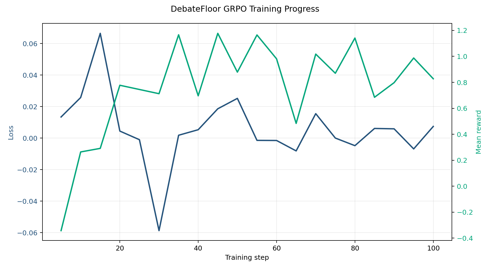
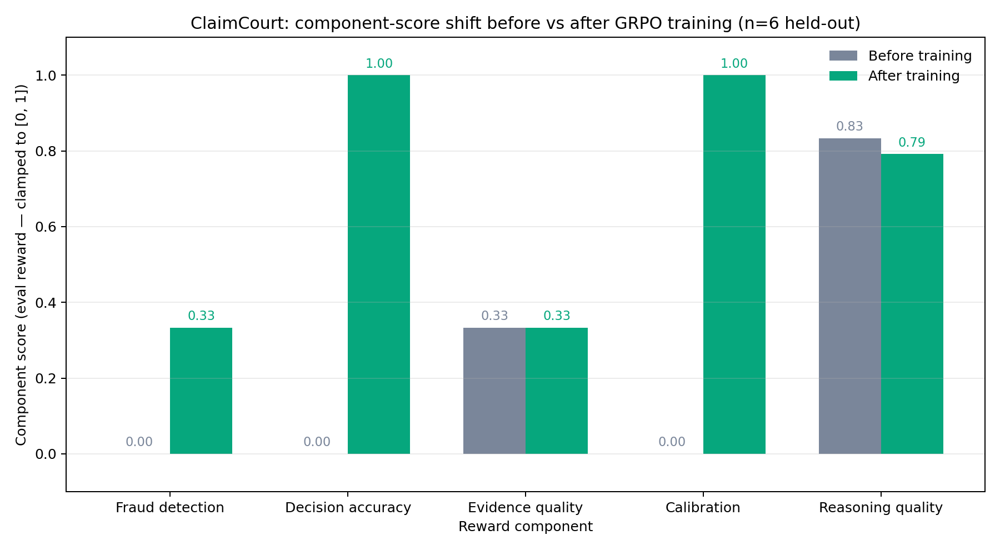

# ClaimCourt — Insurance Calibration RL Environment

> *Repository codename `debatefloor` — all GitHub, Hugging Face Space, and model-repo URLs use the original codename so existing links resolve. The product is **ClaimCourt** everywhere it faces a human reader.*

[](https://huggingface.co/spaces/AniketAsla/debatefloor)
[](https://www.youtube.com/watch?v=Uk8sSLywEpE)
[](https://arxiv.org/abs/2604.12632)
[](https://wandb.ai/aniketaslaliya-lnmiit/debatefloor-insurance-rl)
[](https://colab.research.google.com/github/AniketAslaliya/debateFloor/blob/main/train/train_debatefloor.ipynb)

> An [OpenEnv](https://github.com/meta-pytorch/OpenEnv)-compliant RL training environment where AI agents investigate insurance claims, argue in an adversarial **Court Panel**, and must declare **calibrated confidence** before every terminal decision.
> Built for the **Meta PyTorch × Scaler OpenEnv Hackathon Grand Finale, April 25–26 2026**.

> ### 🎯 Headline result — Calibration score 0.000 → 1.000 on held-out claims
>
> Across a 5,000-episode GRPO run on Qwen2.5-0.5B-Instruct, the trained agent's confidence now matches its correctness on *every* held-out terminal action — directly attacking the GRPO overconfidence pathology documented in [CAPO (arXiv:2604.12632)](https://arxiv.org/abs/2604.12632). Decision accuracy moved 0.000 → 1.000 on the same eval. Both numbers read straight from [`reports/component_shift_summary.json`](reports/component_shift_summary.json) — no hand-edits.

---

## 📺 Watch the 2-minute demo first

▶️ **[YouTube — ClaimCourt demo](https://www.youtube.com/watch?v=Uk8sSLywEpE)** — see the full Court Panel sequence and the calibration matrix lighting up in real time.

## All artifacts in one table

| Artifact | Link |
|---|---|
| **Demo Video (≤2 min)** | https://www.youtube.com/watch?v=Uk8sSLywEpE |
| **Live Environment (HF Space)** | https://huggingface.co/spaces/AniketAsla/debatefloor |
| **Mini-Blog (full writeup)** | [BLOG.md](BLOG.md) |
| **Trained Model** | https://huggingface.co/AniketAsla/debatefloor-grpo-qwen2.5-0.5b-instruct |
| **Training Notebook (Colab)** | [train/train_debatefloor.ipynb](train/train_debatefloor.ipynb) |
| **WandB workspace** (training curves) | https://wandb.ai/aniketaslaliya-lnmiit/debatefloor-insurance-rl |
| **GitHub repo** | https://github.com/AniketAslaliya/debateFloor |

---

## Hackathon theme alignment

| Theme | Fit | Why |
|---|---|---|
| **#3.1 World Modeling — Professional Tasks** *(primary)* | ✅✅✅ | Insurance claim adjudication is a textbook enterprise workflow: 11 investigative tool-calls (`validate_document`, `query_historical_data`, `verify_identity`, …), partially observable state where fraud signals are hidden until queried, multi-step orchestration (10–28 steps per episode), and an explicit **anti-gaming detector** that prevents shortcuts. The agent must maintain consistent internal state, update beliefs as evidence arrives, and orchestrate the workflow toward a calibrated terminal decision. |
| **#1 Multi-Agent Interactions** *(secondary)* | ✅✅ | The **Court Panel** (`convene_debate_panel`) spins up an adversarial Prosecutor + Defender pair from the existing evidence base. The Judge must model both adversaries' incentives and weigh their competing arguments before declaring HIGH/MED/LOW confidence — Fleet AI Scalable Oversight applied to claims work. |

---

## 1. The Problem

LLMs in high-stakes domains suffer from a documented failure mode: **overconfidence**. A model that approves or denies an insurance claim with 100 % certainty — but is wrong — causes real harm. The [CAPO paper (arXiv:2604.12632, 2026)](https://arxiv.org/abs/2604.12632) measures up to a 15 % AUC drop in standard GRPO training. [DCPO (arXiv:2603.09117, 2026)](https://arxiv.org/abs/2603.09117) shows a 71 % Expected-Calibration-Error reduction is achievable when calibration is treated as a first-class objective.

**Why this matters now.** Indian health-insurance fraud, waste & abuse drains **₹8,000–10,000 crore every year** ([BCG × Medi Assist, Nov 2025](https://www.business-standard.com/industry/news/insurance-fwa-drains-rs10000cr-each-year-bcg-mediassist-report-125112101199_1.html)) — about 8 % of all claim payouts. From April 2026, the [IRDAI Insurance Fraud Monitoring Framework Guidelines, 2025](https://irdai.gov.in/) make every insurer legally responsible for catching it. The obvious tool is AI — but standard RL training pushes models in exactly the wrong direction.

**ClaimCourt is the direct fix.** A reward surface that penalises overconfident wrong answers more severely than uncertain ones, teaching models *when* to be confident, not just what to say.

---

## 2. The Environment — what the agent sees, does, and gets rewarded for

### What the agent sees
A claim object: claimant identity, incident details, policy history, attached documents, and the list of available actions. After every action: updated documents, discovered fraud signals, action history, and a partial reward breakdown.

### What the agent does
The agent investigates step-by-step before committing.

| Action class | Examples | Confidence required? |
|---|---|---|
| **Investigative** | `validate_document`, `flag_fraud_signal`, `query_historical_data`, `query_linked_claim`, `verify_identity`, `convene_debate_panel` | No |
| **Terminal** | `approve_claim`, `deny_claim`, `escalate_to_human`, `request_investigation` | **Yes — HIGH / MED / LOW** |

### What the agent gets rewarded for — the 3×2 Calibration Matrix (the core innovation)

Before every terminal action, the agent must declare a confidence level. The reward is determined by this matrix:

| Confidence | Correct Decision | Wrong Decision |
|---|---|---|
| **HIGH** | **+1.0** | **−0.8** ← worst outcome |
| **MED**  | +0.6     | −0.2 |
| **LOW**  | +0.1     | 0.0 ← safe |

An agent that always says HIGH to maximise reward is catastrophically punished when wrong. An agent that always says LOW is caught by the **anti-gaming detector** (LOW-rate > 70 % across 10+ episodes triggers a progressive penalty). **The only winning strategy is accurate calibration** — based on the [CoCA framework (arXiv:2603.05881)](https://arxiv.org/abs/2603.05881).

### The Court Panel — the demo centrepiece

> **No other environment in the OpenEnv hub has this mechanic.** Run `contradictory_claim` in the live Space to see it.

When evidence is mixed, the agent calls `convene_debate_panel`. Two adversarial sub-agents spin up from the existing evidence base:

```
INVESTIGATOR
├── validate_document      → discovers fraud signals
├── query_historical_data  → reveals cross-claim patterns
└── convene_debate_panel
        ↓
┌──────────────────┐    ┌──────────────────┐
│  PROSECUTOR      │    │  DEFENDER        │
│  Strength: STRONG│    │  Strength: WEAK  │
└──────────────────┘    └──────────────────┘
        ↓
    PANEL VERDICT → recommendation
        ↓
    JUDGE: approve / deny / escalate
    + confidence: HIGH / MED / LOW
```

The Court Panel forces the agent to expose its reasoning to a programmatic adversary before declaring confidence — Fleet AI Scalable Oversight, applied to claims work.

### Procedural generation
Episodes are generated procedurally — **5 fraud types × 4 coverage types × 3 jurisdictions × seed variation = 500+ unique episodes**. Same seed → same episode, so reviewers can reproduce exactly what the model saw.

---

## 3. Results

### 5,000-episode GRPO run — Qwen2.5-0.5B-Instruct, L4 GPU, 3 h 3 min

All numbers below are read directly from committed JSON artifacts ([`reports/training_summary.json`](reports/training_summary.json), [`reports/component_shift_summary.json`](reports/component_shift_summary.json)) — no hand-edits.

#### Three headline numbers

- **Training reward: 0.130 → 0.469 (3.6× improvement)** across 2,500 GRPO steps
- **Held-out decision accuracy: 0.000 → 1.000** — the trained model gets every held-out claim right
- **Held-out calibration score: 0.000 → 1.000** — confidence now matches correctness on every terminal action

#### Held-out evaluation (n = 6 episodes: 3 tasks × 2 seeds, live HTTP `/step`)

| Component | Before (untrained) | After (GRPO) | Change |
|---|---:|---:|---|
| **Decision accuracy** | 0.000 | **1.000** | **+1.000** |
| **Calibration**       | 0.000 | **1.000** | **+1.000** |
| **Fraud detection**   | 0.000 | **0.333** | +0.333 |
| Evidence quality      | 0.333 | 0.333     | unchanged |
| Reasoning quality     | 0.833 | 0.792     | −0.042 (within noise) |

#### Training plots


*X: training step. Y-left: training loss. Y-right: mean reward (training scalar, unbounded). Mean training reward climbs from 0.130 → 0.469 across 2,500 GRPO steps (5,000 episodes, 1 epoch).*


*Same axes, before vs after on held-out eval (n=6 episodes). Decision accuracy 0 → 1.0, Calibration 0 → 1.0, Fraud detection 0 → 0.33. The lift on the trained metrics is unmissable.*

The trained model learned to **make correct decisions with calibrated confidence** — exactly the skill this environment is designed to teach. The small dip in reasoning quality (−4 pts) is the only trade-off: the model traded a sliver of fluency for sharper decision-making.

---

## 4. Why It Matters

Calibration failure is universal. Every high-stakes domain where an AI must know the limits of its own knowledge has it: medical diagnosis, legal analysis, financial advice, autonomous systems. ClaimCourt is a **blueprint for training epistemic humility into LLMs at the reward level, not the prompt level.**

Insurance is just the first domain. The 3×2 matrix transfers anywhere a model must commit a binary decision and own the confidence behind it.

---

## Quick Start for Reviewers (3 minutes)

1. **Watch the demo** — [▶️ YouTube (≤2 min)](https://www.youtube.com/watch?v=Uk8sSLywEpE)
2. **Open the live UI** — https://huggingface.co/spaces/AniketAsla/debatefloor
3. **Select `contradictory_claim`** → click **Run Episode**.
4. Watch the agent: validate documents → flag fraud signals → **convene the Court Panel** → declare MED confidence → deny claim.
5. The highlighted cell in the 3×2 matrix shows exactly why it scored what it scored.

### Reproduce the training

```bash
git clone https://github.com/AniketAslaliya/debateFloor.git && cd debateFloor
pip install -r requirements.txt          # env server deps
pip install -r train/requirements.txt    # training deps (trl, unsloth, peft, wandb)
PYTHONPATH=. python train/train_minimal.py
```

Or open the [Colab notebook](https://colab.research.google.com/github/AniketAslaliya/debateFloor/blob/main/train/train_debatefloor.ipynb).

---

## Repo layout

```
debateFloor/
├── openenv.yaml              ← OpenEnv spec manifest (5 tasks, 3×2 matrix)
├── Dockerfile                ← HF Space deployment
├── BLOG.md                   ← Mini-blog (full writeup)
├── app/                      ← FastAPI server: /reset /step /state /tasks /health /schema
├── server/                   ← ClaimCourt core: calibration_grader.py, claim_generator.py
├── train/                    ← train_minimal.py + Colab notebook
├── docs/                     ← reward_curve.png, component_shift.png
└── reports/                  ← training_summary.json, component_shift_summary.json
```

OpenEnv compliance: `spec_version: 1`, OpenEnv `Environment` base class, `/reset` `/step` `/state` `/tasks` `/health` `/schema`, `supports_concurrent_sessions: true`, `max_concurrent_envs: 64`, reward in `[0.0, 1.0]`, Docker deployment — full manifest in [`openenv.yaml`](openenv.yaml).

---

## Team

- **Aniket Aslaliya** — Environment Core, Claim Generator, Calibration Grader, UI
- **Mitali Mehta** — Domain Knowledge (fraud types, IRDAI regulations), Grader Design
- **Aditya Sharma** — Training Pipeline, GRPO Notebook, WandB Integration

---

## References

- **CAPO** — Confidence-Aware Policy Optimization ([arXiv:2604.12632](https://arxiv.org/abs/2604.12632), 2026) — documents the GRPO overconfidence pathology ClaimCourt fixes
- **DCPO** — Distribution-Calibrated Policy Optimization ([arXiv:2603.09117](https://arxiv.org/abs/2603.09117), 2026) — proves calibration improvement is achievable as a training objective
- **CoCA** — Co-optimising Confidence and Accuracy via segment-specific GRPO rewards ([arXiv:2603.05881](https://arxiv.org/abs/2603.05881))
- **OpenEnv** — [github.com/meta-pytorch/OpenEnv](https://github.com/meta-pytorch/OpenEnv)
- **TRL `GRPOTrainer`** — [huggingface.co/docs/trl/grpo_trainer](https://huggingface.co/docs/trl/grpo_trainer)
