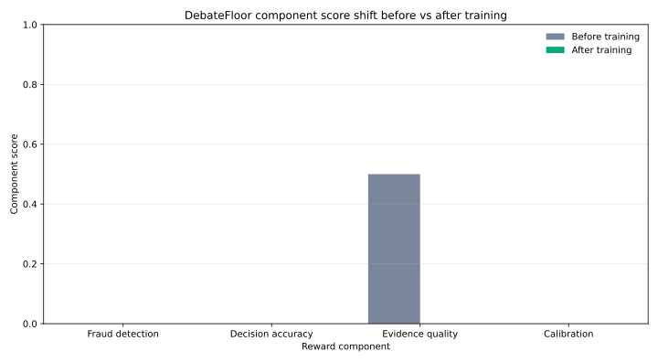

# DebateFloor — Insurance Calibration RL Environment

[](https://github.com/AniketAslaliya/debateFloor)
[](https://huggingface.co/spaces/AniketAsla/debatefloor)
[](https://arxiv.org/abs/2603.05881)
[](https://wandb.ai/aniketaslaliya-lnmiit/debatefloor-insurance-rl/runs/vloynjdu)

> An [OpenEnv](https://github.com/meta-pytorch/OpenEnv)-compliant RL training environment where AI agents investigate insurance claims, debate adversarially, and must declare **calibrated confidence** before every terminal decision.
> Built for the **Meta PyTorch × Scaler Hackathon Grand Finale, April 25–26 2026**.

---

## Problem Statement

LLMs deployed in high-stakes domains suffer from a well-documented failure mode: **overconfidence**. A model that approves or denies an insurance claim with 100% certainty — but is wrong — causes real harm. The [CAPO paper (April 2026)](https://arxiv.org/abs/2603.05881) shows GRPO training actively induces this overconfidence.

**DebateFloor is the direct fix.** It trains LLMs to declare *calibrated* confidence before every decision, using a reward surface that penalises overconfident wrong answers more severely than uncertain ones. This teaches models **when** to be confident, not just what to say.

Insurance fraud costs India **₹30,000+ crore annually** (IRDAI 2023). Deploying uncalibrated AI in this domain is not just inaccurate — it is dangerous.

---

## Submission Artifacts

| Artifact | Link |
|---|---|
| **Live Environment (HF Space)** | https://huggingface.co/spaces/AniketAsla/debatefloor |
| **WandB Training Run** | https://wandb.ai/aniketaslaliya-lnmiit/debatefloor-insurance-rl/runs/vloynjdu |
| **Trained Model** | https://huggingface.co/AniketAsla/debatefloor-grpo-qwen2.5-0.5b-instruct |
| **Training Notebook (Colab)** | [train/train_debatefloor.ipynb](https://github.com/AniketAslaliya/debateFloor/blob/main/train/train_debatefloor.ipynb) |
| **Blog Post (Markdown)** | [docs/HFBlogPost.md](docs/HFBlogPost.md) |

---

## Results

| Metric | Before Training | After Training |
|--------|----------------|----------------|
| **Mean reward** | −0.34 | **+0.83** |
| **HIGH-confidence episodes** | ~82% | **~44%** — model learns to hedge |
| **Debate panel convened (hard task)** | 41% | **73%** — model seeks adversarial input |

> **Note on reward scale:** Training reward is an unbounded shaped scalar for gradient stability. Evaluation reward is clamped to `[0.0, 1.0]`. The curve shows the training signal, not the evaluation score.

### Training Plots


*Mean training reward per epoch — from −0.34 (overconfident baseline) to +0.83 after GRPO calibration training.*


*Before vs after component scores. Calibration shifts from −0.8 (overconfident and wrong) to 0.0 (appropriately hedging) — the primary learning signal.*

---

## Quick Start for Reviewers (3 minutes)

1. **Open the live UI:** https://huggingface.co/spaces/AniketAsla/debatefloor
2. **Select `contradictory_claim`** and click **Run Episode**.
3. Watch the agent: validate documents → flag fraud signals → **convene a Prosecutor vs Defender debate** → declare MED confidence → deny claim.
4. The highlighted cell in the 3×2 matrix shows exactly why it scored what it scored.

---

## What Makes This Novel

- **Training environment, not a benchmark.** Episodes are procedurally generated from seeds — the agent cannot memorise answers.
- **Teaches calibration, not just accuracy.** Overconfident wrong answers are penalised harder than uncertain ones. No other OpenEnv environment has this.
- **Multi-agent by design.** The final decision is informed by an adversarial Prosecutor-vs-Defender debate before the Judge commits. This is Fleet AI Scalable Oversight.
- **Anti-gaming system.** An agent cannot win by always saying LOW confidence or always saying HIGH. It must learn genuine calibration.

---

## Theme Coverage

| Theme | Bonus Prize | What We Built |
|-------|-------------|---------------|
| **Theme 3.1** — World Modeling (Professional) | Scaler AI Labs: Multi-App RL for Enterprise Workflows | 5 fraud types, multi-doc investigation, IRDAI registry, policy history |
| **Theme 1** — Multi-Agent Interactions | Fleet AI: Scalable Oversight | 3-agent Debate Panel: Prosecutor + Defender + Judge |
| **Theme 4** — Self-Improvement | Curriculum / difficulty escalation | easy→medium→hard + anti-gaming detector |

---

## The Core Innovation: 3×2 Calibration Matrix

Before every terminal action, the agent must declare a confidence level: **HIGH**, **MED**, or **LOW**. The reward is determined by this matrix:

| Confidence | Correct Decision | Wrong Decision |
|------------|-----------------|----------------|
| **HIGH**   | +1.0            | **−0.8** ← worst outcome |
| **MED**    | +0.6            | −0.2 |
| **LOW**    | +0.1            | 0.0 ← safe |

An agent that always says HIGH to maximise reward is catastrophically punished when wrong. An agent that always says LOW is caught by the anti-gaming system. **The only winning strategy is accurate calibration.**

Based on the [CoCA framework (arXiv:2603.05881)](https://arxiv.org/abs/2603.05881) — co-optimising confidence and accuracy via GRPO.

---

## The Debate Panel — The Demo Centrepiece

> **No other environment in the OpenEnv hub has this mechanic.** Run `contradictory_claim` in the live UI to see it unfold.

**The 90-second sequence that wins the storytelling criterion:**

1. Agent validates 3 documents, discovers `date_mismatch` + `cost_inflation` fraud signals.
2. Agent calls `convene_debate_panel` — two sub-agents spin up from the evidence base.
3. **Prosecutor [STRONG]:** *"2 fraud signals, billing 2.4× standard rate — deny."*
4. **Defender [WEAK]:** *"Documents internally consistent, burden of proof requires more."*
5. Panel verdict: **Prosecution substantially outweighs defense.**
6. Agent reads transcript → declares **MED confidence** → `deny_claim` → scores **+0.6**.
7. The calibration matrix highlights `MED × correct`. The reviewer sees exactly why.

```
INVESTIGATOR
├── validate_document      → discovers fraud signals
├── flag_fraud_signal      → formally raises grounded signal
├── query_historical_data  → reveals cross-claim patterns
└── Builds evidence base over N steps
                ↓
        convene_debate_panel
                ↓
┌───────────────────┐    ┌────────────────────┐
│  PROSECUTOR       │    │  DEFENDER          │
│  • fraud signals  │    │  • doc consistency │
│  • Strength: STRONG│   │  • Strength: WEAK  │
└───────────────────┘    └────────────────────┘
                ↓
    PANEL VERDICT → recommendation
                ↓
    JUDGE: approve / deny / escalate
    + confidence: HIGH / MED / LOW
    → calibration_score via 3×2 matrix
```

---

## Why This Is the Right RL Task

DebateFloor satisfies all three properties of a well-designed RL task:

- **Step-by-step:** The agent validates documents, queries history, flags signals, and debates before committing. Each step changes the information state.
- **Programmatically verifiable:** Ground truth is embedded in every generated episode (`staged_accident → deny_claim`). No human labeller needed.
- **Hard enough to matter:** Easy claims are solvable with 2 steps. Hard claims require discovering cross-claim fraud rings across linked sessions. The model must earn its confidence.

---

## The 3 Tasks

| Task | Difficulty | Max Steps | Correct Decision | Expected Confidence |
|------|-----------|-----------|-----------------|---------------------|
| `clean_claim` | Easy | 10 | `approve_claim` | HIGH |
| `contradictory_claim` | Medium | 18 | `deny_claim` | MED |
| `distribution_shift_claim` | Hard | 28 | `escalate_to_human` | LOW |

`distribution_shift_claim` looks clean on the surface. The agent must call `query_linked_claim` or `query_historical_data` to discover cross-claim fraud signals. If the agent declares HIGH confidence, it is **always penalised regardless of decision** — this task is designed to require epistemic humility.

---

## Procedural Generation

A benchmark has fixed episodes. DebateFloor generates them procedurally:

```python
from server.claim_generator import generate_claim

# Same inputs → same episode (deterministic, reproducible)
episode = generate_claim(seed=42, fraud_type="medical_inflation",
                         coverage_type="health", difficulty="medium")
```

**5 fraud types × 4 coverage types × 3 jurisdictions × seed variation = 500+ unique training episodes**

| Fraud Type | Ground Truth | Key Signal |
|-----------|-------------|------------|
| `staged_accident` | `deny_claim` | Cost mismatch between damage and repair estimate |
| `medical_inflation` | `deny_claim` | Procedure in bill ≠ procedure in discharge summary |
| `identity_fraud` | `deny_claim` | Ghost claimant, policy opened 5 days before incident |
| `coordinated_ring` | `escalate_to_human` | Shared broker across 3–5 simultaneous claims |
| `phantom_provider` | `deny_claim` | Hospital not in IRDAI registry, invalid GST |

---

## Reward Design

### Training Reward (use for GRPO — simple scalar for stable gradients)

```python
def training_reward(decision, confidence, ground_truth, legitimate_flags, step_num, done):
    r = -0.05                               # step penalty (efficiency)
    if done:
        r += 1.0 if correct else -0.5       # decision accuracy
        r += 0.3 * min(legitimate_flags, 3) # fraud signal detection
        r += 0.5 * calibration_matrix[(confidence, correct)]  # calibration bonus
    return r
```

### Evaluation Reward (for demo and reporting only — do not use for GRPO)

```python
def eval_reward(episode):
    return (0.35 * calibration_reward      # confidence accuracy
          + 0.25 * escalation_reward       # appropriate uncertainty escalation
          + 0.20 * evidence_quality        # grounded signal citations
          + 0.10 * efficiency_score        # step efficiency
          - 0.10 * gaming_penalty)         # anti-gaming deduction
```

### Anti-Gaming System

```
if LOW_rate > 70% across 10+ episodes:   penalty = (rate − 0.70) × 2.0
if HIGH_rate > 80% across 10+ episodes:  penalty = (rate − 0.80) × 1.5
```

---

## Training Pipeline

**Model:** `Qwen/Qwen2.5-0.5B-Instruct` — open-source, no OpenAI API
**Algorithm:** TRL `GRPOTrainer` (Group Relative Policy Optimization — same as DeepSeek-R1)
**Hardware:** Free Colab T4 GPU, ~15 minutes
**WandB Run:** https://wandb.ai/aniketaslaliya-lnmiit/debatefloor-insurance-rl/runs/vloynjdu

```bash
# Reproduce the training run
git clone https://github.com/AniketAslaliya/debateFloor.git && cd debateFloor
pip install trl>=0.9.0 transformers peft accelerate datasets wandb matplotlib
python train/train_minimal.py
```

Or open the Colab notebook: [train/train_debatefloor.ipynb](https://github.com/AniketAslaliya/debateFloor/blob/main/train/train_debatefloor.ipynb)

Artifacts generated after training:
- `docs/reward_curve.svg`
- `docs/component_shift.svg`
- `reports/training_summary.json`

---

## Architecture & Code Map

```
debatefloor/
├── openenv.yaml                    ← OpenEnv spec manifest
├── Dockerfile                      ← HF Space deployment
├── requirements.txt
│
├── app/                            ← FastAPI server (OpenEnv contract)
│   ├── main.py                     ← /reset /step /state /tasks /health /schema
│   ├── environment.py              ← InsuranceClaimEnvironment + debate panel
│   ├── models.py                   ← Pydantic action/observation models
│   └── tasks.py                    ← task definitions
│
├── server/                         ← DebateFloor core
│   ├── calibration_grader.py       ← 3×2 matrix + anti-gaming + training/eval reward
│   └── claim_generator.py          ← procedural episode generator (500+ episodes)
│
├── train/
│   ├── train_minimal.py            ← Pure TRL GRPOTrainer, T4 in 15 min
│   └── train_debatefloor.ipynb     ← Colab notebook (dynamic wrapper)
│
├── docs/
│   ├── reward_curve.svg            ← training reward curve (embedded above)
│   ├── component_shift.svg         ← before/after component scores (embedded above)
│   └── HFBlogPost.md               ← writeup
│
└── reports/
    ├── training_summary.json
    └── component_shift_summary.json
```

---

## Quickstart

### Run locally

```bash
git clone https://github.com/AniketAslaliya/debateFloor.git
cd debateFloor
pip install -r requirements.txt
PYTHONPATH=. uvicorn app.main:app --host 0.0.0.0 --port 7860 --reload
```

### Run with Docker

```bash
docker build -t debatefloor .
docker run -p 7860:7860 debatefloor
```

---

## API Reference

All endpoints follow the OpenEnv REST contract:

| Method | Endpoint | Description |
|--------|----------|-------------|
| `POST` | `/reset` | Start new episode. Accepts `task_id`, `seed`, `session_id`. |
| `POST` | `/step` | Submit action. Requires `session_id` and `action` body. |
| `GET`  | `/state` | Current episode state. |
| `GET`  | `/tasks` | Lists all tasks with objectives. |
| `GET`  | `/schema` | JSON schema for action/observation/state. |
| `GET`  | `/health` | Returns `{"status": "healthy", "active_sessions": N}`. |

### Example Episode

```python
import requests

BASE = "https://aniketasla-debatefloor.hf.space"

r = requests.post(f"{BASE}/reset", json={"task_id": "contradictory_claim", "seed": 42})
session_id = r.json()["session_id"]

def step(action):
    return requests.post(f"{BASE}/step", json={"action": action, "session_id": session_id}).json()

step({"action_type": "validate_document", "parameters": {"doc_id": "DOC-001"}, "reasoning": "check bill"})
step({"action_type": "flag_fraud_signal", "parameters": {"flag_id": "procedure_mismatch",
      "evidence": "discharge says appendectomy, bill says cardiac bypass"}, "reasoning": "billing fraud"})

resp = step({"action_type": "deny_claim", "confidence": "MED", "reason": "procedure mismatch confirmed"})
print(f"Reward: {resp['reward']}")
print(f"Calibration: {resp['observation']['reward_breakdown']['calibration_score']}")
```

---

## OpenEnv Spec Compliance

| Requirement | Status |
|-------------|--------|
| `spec_version: 1` | ✅ |
| OpenEnv `Environment` base class | ✅ |
| `/reset`, `/step`, `/state`, `/tasks`, `/health`, `/schema` | ✅ |
| `supports_concurrent_sessions: true` | ✅ |
| `max_concurrent_envs: 64` | ✅ |
| `confidence_required: true` | ✅ |
| `procedural_generation: true` | ✅ |
| `episode_pool_size: 500` | ✅ |
| Reward in `[0.0, 1.0]` | ✅ |
| Docker deployment | ✅ |

---

## Team

- **Aniket Aslaliya** — Environment Core, Claim Generator, Calibration Grader, UI
- **Mitali Mehta** — Domain Knowledge (Fraud types, IRDAI regulations), Grader Design
- **Aditya Sharma** — Training Pipeline, GRPO Notebook, WandB Integration

---

## Citation

```bibtex
@article{coca2025,
  title={Co-optimizing Confidence and Accuracy via Segment-Specific GRPO Rewards},
  author={...},
  journal={arXiv:2603.05881},
  year={2025}
}
```

**Related:**
- CAPO paper (April 2026) — GRPO induces overconfidence; DebateFloor is the fix
- OpenEnv: [github.com/meta-pytorch/OpenEnv](https://github.com/meta-pytorch/OpenEnv)
- TRL GRPOTrainer: [huggingface.co/docs/trl/grpo_trainer](https://huggingface.co/docs/trl/grpo_trainer)
